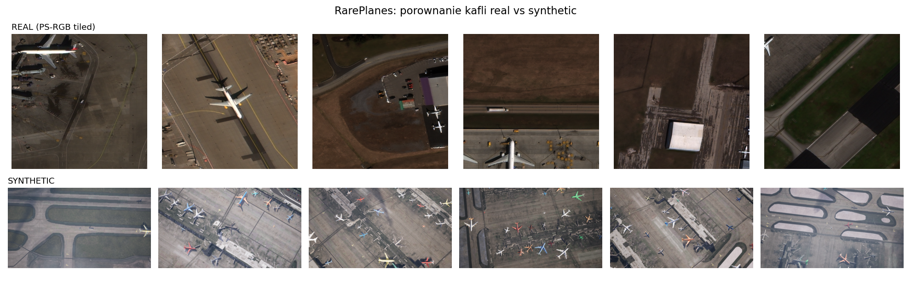
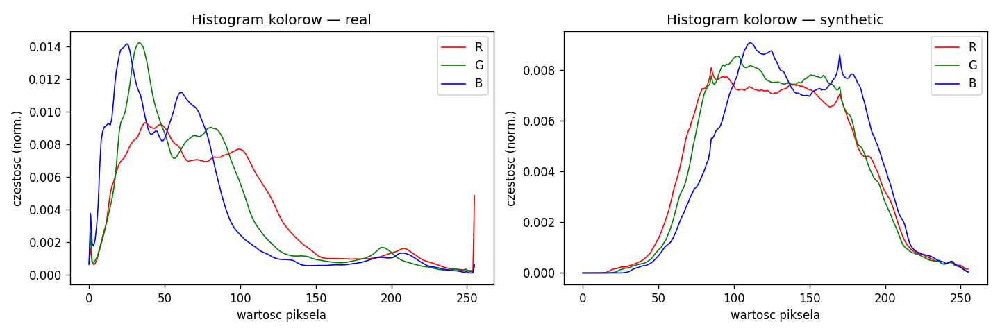
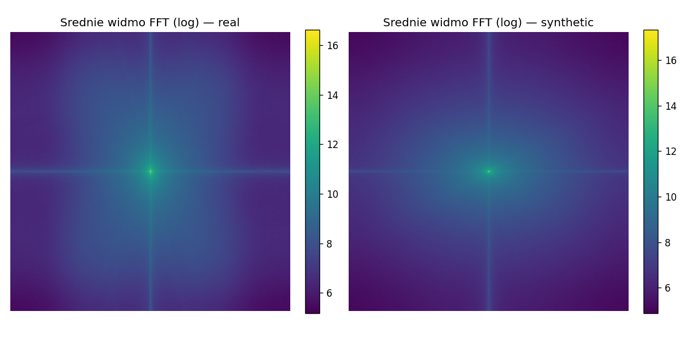
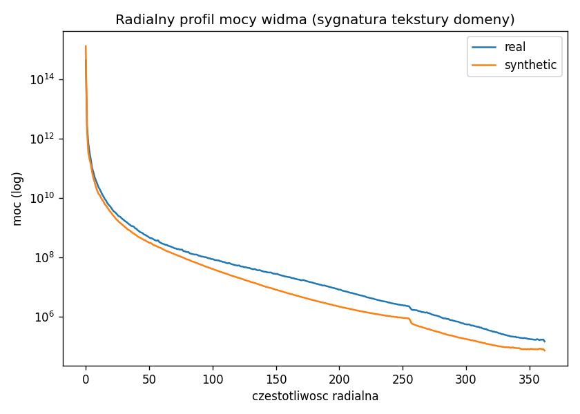
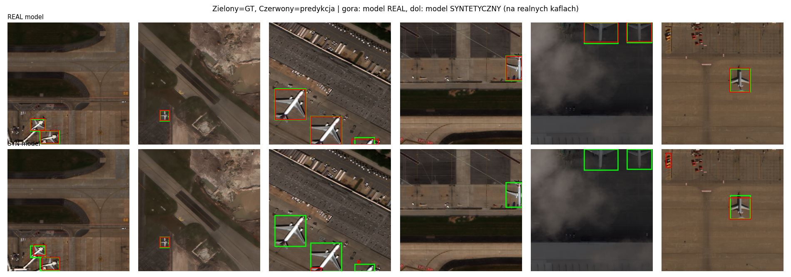
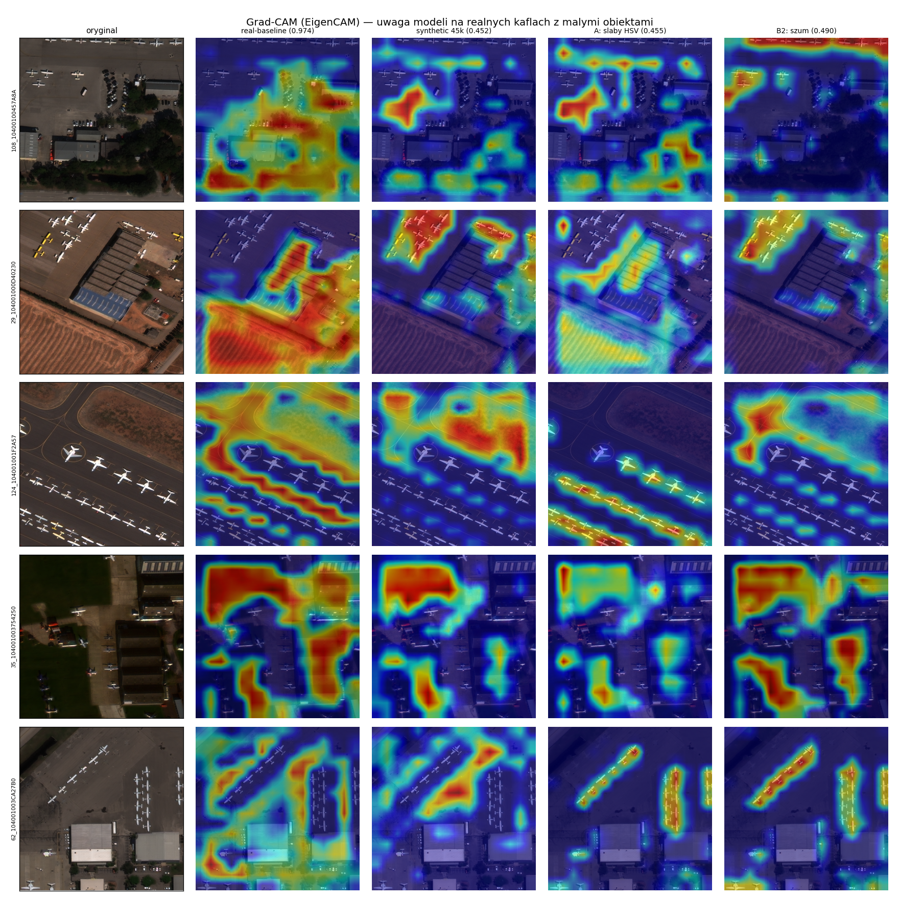

# Detekcja samolotów na zdjęciach satelitarnych pod przesunięciem domeny synthetic-to-real

**Projekt 4 - Deep Learning / Computer Vision.** Autorzy: Miłosz, Jakub.  
Repozytorium: `github.com/JakubPaszke/rareplanes-domain-shift`.

## Abstrakt

Projekt bada lukę domenową między syntetycznymi i rzeczywistymi zdjęciami satelitarnymi w zadaniu detekcji samolotów na zbiorze RarePlanes. Głównym modelem eksperymentalnym był YOLOv10n trenowany w formacie YOLO po konwersji adnotacji COCO, a jako metryki porównawcze przyjęto ewaluację COCO na rzeczywistym holdoucie testowym. Punkt odniesienia trenowany i testowany na danych realnych osiągnął `AP@.5=0.9737` oraz `AP@[.5:.95]=0.8073`. Naiwny transfer z pełnej syntetyki 45k na realny test był dużo słabszy: `AP@.5=0.4525`, `AP@[.5:.95]=0.2683`.

Przetestowano cztery rodziny interwencji: fotometrię HSV, degradację częstotliwościową, mixed training z domieszką realnych obrazów oraz zmianę rozdzielczości wejścia. Najsilniejszy wynik dał eksperyment C: dodanie 25% dostępnego realnego train/val do 10k syntetyków, co odpowiadało około 11% realnych obrazów w zbiorze treningowym, podniosło wynik do `AP@.5=0.9466` i `AP@[.5:.95]=0.7120`. Model finalny 45k połączył decyzje B2+C+D+A1: szum `noise_sigma=8.0`, `real_frac=0.25`, `imgsz=320` i łagodne HSV `0.015/0.4/0.3`. Osiągnął `AP@.5=0.9031` oraz `AP@[.5:.95]=0.6332`, czyli bardzo poprawił czysty baseline synthetic 45k, ale nie przebił C 25% na 10k. Główny wniosek jest więc praktyczny: realne próbki działają jak kotwica domenowa silniej niż sama ekspansja syntetyki, a efekty dobrych decyzji nie sumują się liniowo.

## Pytanie badawcze i hipotezy

Dane syntetyczne są atrakcyjne w detekcji obiektów, bo pozwalają generować duże zbiory z pełnymi adnotacjami bez kosztownego ręcznego etykietowania. Ich problemem jest jednak luka domenowa: model dobrze dopasowany do renderów może gwałtownie tracić jakość na obrazach rzeczywistych. RarePlanes jest dobrym przypadkiem testowym, bo zawiera zarówno dane realne, jak i syntetyczne dla tego samego zadania: detekcji samolotów w kaflach satelitarnych.

Pytanie badawcze:

```text
Jak skutecznie zmniejszyć spadek jakości detektora trenowanego na syntetycznych
zdjęciach RarePlanes po przeniesieniu na rzeczywiste zdjęcia satelitarne?
```

Hipotezy projektu:

| Hipoteza | Treść | Eksperyment |
|---|---|---|
| HA | Dopasowanie fotometrii i augmentacja HSV zmniejszą różnice kolorystyczne synthetic-real. | A |
| HB | Szum i degradacje częstotliwościowe upodobnią synthetic do realnych zdjęć satelitarnych. | B |
| HC | Nawet niewielka liczba realnych próbek mocno poprawi transfer. | C |
| HD | Zmiana skali wejścia pomoże wykrywaniu małych realnych obiektów. | D |
| HArch | Architektura wpływa na odporność modelu na domain shift. | porównanie architektur |

Wyniki odwróciły część intuicji. Szczególnie hipoteza HD została potwierdzona w kierunku przeciwnym do pierwotnej intuicji: nie większa, lecz mniejsza rozdzielczość `imgsz=320` poprawiła transfer.

## Przegląd literatury

Luka domenowa między danymi syntetycznymi a rzeczywistymi jest jednym z centralnych problemów uczenia z renderów. Klasyczne podejście *domain randomization* (Tobin i in., IROS 2017, arXiv:1703.06907) zakłada, że losowanie tekstur, oświetlenia i tła w symulacji zmusza model do uczenia się cech niezmienniczych względem domeny — przy dostatecznej zmienności symulacji rzeczywistość staje się dla modelu "kolejnym wariantem". Nasze eksperymenty A i B mieszczą się w tej rodzinie: HSV i degradacja częstotliwościowa to próby zasypania mierzalnych różnic fotometryczno-spektralnych między domenami. Nasze wyniki pokazują jednak, że taka korekta na poziomie obrazu domyka lukę tylko marginalnie (A1: `AP@.5=0.4591`, B2: `0.4897` wobec baseline `0.4525`).

Drugą rodziną metod jest adaptacja przez domieszkę danych docelowych. Prace o *few-shot* i mieszanym treningu pokazują, że nawet niewielki udział realnych próbek silnie kotwiczy reprezentację w domenie docelowej — co w naszym projekcie potwierdza eksperyment C i czyni go najsilniejszą dźwignią (już 1% realnego splitu podnosi `AP@.5` z `0.4525` do `0.6666`). Jest to spójne z szerszą obserwacją z nurtu *data-centric*, że dobór danych treningowych bywa ważniejszy niż architektura: w naszych pomiarach zmiana składu danych dała `+0.49 AP@.5`, a zmiana architektury jedynie `+0.008`.

Zbiór **RarePlanes** (Shermeyer i in., 2020, arXiv:2006.02963) został zaprojektowany właśnie do badania tej luki: dostarcza dane rzeczywiste (253 sceny Maxar WorldView-3, ~14,7 tys. ręcznie oznaczonych samolotów) oraz syntetyczne (~50 tys. obrazów z platformy AI.Reverie, ~600 tys. adnotacji), z bogatą semantyką ról i atrybutów. Oryginalna praca pokazała, że dodanie syntetyki do realnego treningu poprawia detekcję; nasz projekt zadaje pytanie odwrotne — jak daleko można zajść *zaczynając* od syntetyki i dokładając jak najmniej realnych danych.

Po stronie architektur porównujemy jednostopniowe detektory CNN z rodziny YOLO (YOLOv10, Wang i in., NeurIPS 2024, arXiv:2405.14458) z detektorami transformerowymi typu DETR w wariancie czasu rzeczywistego (RT-DETR, Lv i in., 2023, arXiv:2304.08069). Co istotne dla naszej obserwacji, *obie* te architektury są end-to-end i rezygnują z NMS — YOLOv10 przez spójne podwójne przypisania w treningu, RT-DETR przez paradygmat predykcji zbioru z dopasowaniem węgierskim. Pozwala to wprost zbadać, czy brak NMS pomaga, czy szkodzi pod przesunięciem domeny: w naszych wynikach oba modele RT-DETR zwracają maksymalne 300 detekcji na obraz na realnym teście, co sugeruje, że mechanizm bez progu/NMS gorzej kalibruje się na obcej domenie. Do interpretowalności używamy EigenCAM (Muhammad i Yeasin, IJCNN 2020, arXiv:2008.00299) — wariantu opartego na głównych składowych aktywacji, który nie wymaga gradientu względem klasy, a więc lepiej pasuje do detektorów end-to-end niż klasyczny Grad-CAM.

## Dane RarePlanes i licencja

Projekt korzysta ze zbioru RarePlanes, Shermeyer et al., 2020, udostępnionego na licencji Creative Commons Attribution-ShareAlike 4.0 International. W repozytorium nie redystrybuowano obrazów. Dane są pobierane i przetwarzane skryptami, a w gicie pozostają kod, notatki, lekkie wyniki oraz figury.

Użyty wariant obrazów realnych to `PS-RGB_tiled`: kafle RGB porównywalne z obrazami syntetycznymi. Warianty MS/PAN pominięto, bo mają inne kanały i nie byłyby bezpośrednio porównywalne z syntetycznym RGB. Zadanie sprowadzono do jednej klasy `aircraft`, aby mierzyć lokalizację samolotów bez dodatkowego problemu klasyfikacji ról.

| Zbiór | Obrazy | Instancje | Instancje/obraz |
|---|---:|---:|---:|
| real train | 5 815 | 18 393 | 3.16 |
| real test | 2 710 | 6 812 | 2.51 |
| synthetic train | 45 000 | 566 143 | 12.58 |
| synthetic test | 5 000 | 62 841 | 12.57 |

## Analiza domain shift

### Rozmiar obiektów i gęstość scen

Najsilniejszy shift adnotacyjny dotyczy rozmiaru samolotów i gęstości scen. Dane syntetyczne mają znacznie więcej obiektów na obraz oraz dużo większy udział średnich i dużych samolotów. Realny train zawiera natomiast znacznie więcej małych obiektów.

| Zbiór | small | medium | large | Mediana bbox |
|---|---:|---:|---:|---:|
| real train | 43.8% | 44.0% | 12.2% | 1 180 px² |
| real test | 24.9% | 51.1% | 23.9% | 2 505 px² |
| synthetic train | 10.2% | 51.3% | 38.5% | 6 776 px² |
| synthetic test | 10.1% | 51.8% | 38.0% | 6 675 px² |

To ma dwie konsekwencje. Po pierwsze, model trenowany na syntetyce uczy się częściej większych, łatwiejszych obiektów i gęstszych scen. Po drugie, nawet między `real train` i `real test` istnieje przesunięcie: real test ma mniejszy udział obiektów small niż real train. Nie wszystkie różnice w wynikach wolno więc przypisywać wyłącznie synthetic-to-real.

### Role i uproszczenie do jednej klasy

W danych RarePlanes występują role samolotów, ale rozkład ról również różni się między domenami. Real train jest mocniej obciążony małymi samolotami, a synthetic ma większy udział średnich i dużych obiektów. Dlatego pipeline finalnie używa jednej klasy `aircraft`: celem projektu było zbadanie lokalizacji pod domain shift, a nie rozszerzenie problemu o klasyfikację typów samolotów.

### Kolor, tekstura i częstotliwości

Analiza wyglądu z `notes/02_analiza_wygladu.md` pokazała, że realne kafle są ciemniejsze, bardziej nasycone i zawierają więcej energii wysokoczęstotliwościowej. Syntetyki są jaśniejsze, gładsze i chłodniejsze kolorystycznie.

| Cecha | Real | Synthetic | Interpretacja |
|---|---:|---:|---|
| Średnia jasność | 71.7 | 133.0 | synthetic jest dużo jaśniejszy |
| Średnia saturacja | 0.303 | 0.122 | real jest bardziej nasycony |
| Średnie RGB | 82 / 71 / 62 | 129 / 131 / 139 | real cieplejszy, synthetic chłodniejszy |
| FFT | więcej wysokich częstotliwości | gładsze widmo | real zawiera szum/szczegóły sensora |

Artefakty wizualne użyte w raporcie:









## Metoda i protokół

Głównym modelem był `YOLOv10n`, startujący z wag pretrained COCO. Dane RarePlanes w formacie COCO konwertowano do YOLO przez `src/coco_to_yolo.py`. Trening wykonywał `src/train_yolo.py`, a ewaluację na realnym holdoucie `src/eval_per_size.py` z użyciem metryk COCO i rozbiciem po rozmiarach obiektów.

Główne metryki raportowe:

- `AP@.5`,
- `AP@[.5:.95]`,
- `AP_small`,
- `AP_medium`,
- `AP_large`,
- `AR@100`,
- detekcje/obraz jako `n_detections / 2710`.

Realny holdout testowy nie był używany do treningu ani do budowania mixed-val. Wszystkie liczby w tabelach raportu pochodzą z ewaluacji COCO na tym holdoucie (`results/per_size/*.json`). Walidacja Ultralytics/YOLO na zbiorach treningowych (`results/baselines/*.json`) służyła wyłącznie jako kontrola poprawności treningu i nie jest tu raportowana jako miara transferu — jej `mAP50` liczone na danych syntetycznych lub mieszanych nie jest porównywalne z `AP@.5` na realnym teście. Oprócz AP raportujemy liczbę detekcji na obraz (`n_detections / 2710`), bo samo AP nie pokazuje, że niektóre modele — zwłaszcza synthetic 45k i RT-DETR — generują bardzo wielu kandydatów (do 300 na obraz), co jest sygnałem słabej kalibracji na obcej domenie.

| Grupa wyników | Dane treningowe | Epoki | Batch | `imgsz` |
|---|---|---:|---:|---:|
| Real baseline | real train/val | 100 | 64 | 512 |
| Synthetic 6460 | synthetic subset, 3 lotniska | 100 | 64 | 512 |
| Synthetic 45k | pełne synthetic 45k | 100 | 64 | 512 |
| A | synthetic 10k/45k + HSV | 60 / final 45k | różne | 512 |
| B | synthetic 10k po degradacji plikowej | 60 | 32 | 512 |
| C | synthetic 10k + real train/val | 30 | 32 | 512 |
| D | synthetic 10k, sweep skali | 45 | 16 | 320/768/1024 |
| Architektury | synthetic 10k | różne | różne | 512 |
| Final 45k | synthetic 45k B2 + real_frac 0.25 + A1 | 60 | 64 | 320 |

Źródła metryk dla każdej grupy to odpowiadające pliki `results/per_size/*.json` (spis w sekcji „Artefakty w repo").

Rodziny eksperymentów A/B/C/D i porównanie architektur różnią się liczbą obrazów, epok, wartościami `batch` i `imgsz` oraz sprzętem. Dlatego ranking między rodzinami traktujemy jako praktyczne porównanie skuteczności na realnym holdoucie, a mocniejsze wnioski przyczynowe formułujemy wewnątrz pojedynczej rodziny, gdzie protokół jest stały — na przykład B2 wobec B1/B3 albo C 1/5/10/25%.

## Baseline'y

Baseline real->real jest górnym punktem odniesienia: pokazuje, co potrafi YOLOv10n, gdy dane treningowe i testowe są z tej samej domeny. Baseline synthetic->real mierzy właściwą lukę domenową.

| Model | AP@.5 | AP@[.5:.95] | AP_S | AP_M | AP_L | AR@100 | Det/img |
|---|---:|---:|---:|---:|---:|---:|---:|
| Real baseline | 0.9737 | 0.8073 | 0.7586 | 0.7825 | 0.8991 | 0.8465 | 9.5 |
| Synthetic 6460 | 0.4095 | 0.2388 | 0.2624 | 0.3284 | 0.0671 | 0.3686 | 33.8 |
| Synthetic 45k | 0.4525 | 0.2683 | 0.2859 | 0.3839 | 0.2008 | 0.5459 | 300.0 |

Przejście z 6460 syntetyków do pełnych 45k pomaga, ale umiarkowanie: `AP@.5` rośnie z `0.4095` do `0.4525`, a `AP@[.5:.95]` z `0.2388` do `0.2683`. Największa poprawa pojawia się dla dużych obiektów (`AP_large` z `0.0671` do `0.2008`), co jest spójne z rozkładem danych syntetycznych, gdzie duże obiekty są znacznie częstsze niż w realnym train.

Równocześnie synthetic 45k zwraca maksymalne `300.0` detekcji na obraz przy ewaluacji z niskim progiem confidence. To sugeruje model mocno "rozgadany": poprawia recall, ale generuje bardzo dużo kandydatów. Ta obserwacja jest niewidoczna, jeśli patrzymy wyłącznie na AP.

Skalę luki dobrze widać też na samej precyzji detektora. Ten sam model synthetic 45k na walidacji syntetycznej osiąga precyzję `P=0.98` i `mAP50=0.98`, natomiast na rzeczywistym holdoucie precyzja spada do `P=0.64` (`mAP50=0.39` w mierze Ultralytics). Rząd wielkości tego spadku — z ~98% do ~64% precyzji — jest zgodny z oczekiwaniem, że naiwny transfer z czystej syntetyki na zdjęcia rzeczywiste utrzymuje precyzję rzędu zaledwie ~60%. Dopiero domieszka realnych próbek (eksperyment C) i model finalny domykają tę różnicę.



## Eksperyment A: fotometria HSV

Eksperyment A sprawdzał, czy wzmocnienie augmentacji fotometrycznej ograniczy różnice kolorystyczne między synthetic i real. Testowano warianty HSV na 10k syntetyków oraz wariant A1 na pełniejszym treningu 45k.

| Wariant | Opis | AP@.5 | AP@[.5:.95] | AP_S | AP_M | AP_L | AR@100 |
|---|---|---:|---:|---:|---:|---:|---:|
| Synthetic 45k baseline | bez A1 | 0.4525 | 0.2683 | 0.2859 | 0.3839 | 0.2008 | 0.5459 |
| A1 weak 10k | łagodne HSV | 0.4591 | 0.2643 | 0.3056 | 0.3571 | 0.0908 | 0.3970 |
| A2 medium 10k | mocniejsze HSV | 0.4308 | 0.2469 | 0.2646 | 0.3447 | 0.0986 | 0.3931 |
| A3 strong 10k | silne HSV | 0.4463 | 0.2520 | 0.2679 | 0.3443 | 0.1052 | 0.3941 |
| A1 weak 45k | finalny wariant A | 0.4549 | 0.2684 | 0.3370 | 0.3545 | 0.0902 | 0.4043 |

A1 jest najlepszym ustawieniem HSV w tej rodzinie, ale globalny zysk jest marginalny. Na 45k `AP@.5` rośnie tylko z `0.4525` do `0.4549`, a `AP@[.5:.95]` praktycznie się nie zmienia. Ważniejsza jest redystrybucja jakości: `AP_small` rośnie z `0.2859` do `0.3370`, ale `AP_large` spada z `0.2008` do `0.0902`.

Wniosek: HA jest potwierdzona słabo. Fotometria pomaga małym obiektom, ale nie domyka globalnej luki domenowej i może pogorszyć detekcję dużych obiektów.

## Eksperyment B: degradacja częstotliwościowa

Eksperyment B wynikał z analizy FFT: realne zdjęcia zawierały więcej wysokich częstotliwości niż gładkie syntetyki. Testowano degradacje materializowane do plików, a nie wersję on-the-fly, ponieważ wcześniejsze uruchomienie on-the-fly okazało się niewiarygodne i nie jest źródłem wyników raportowych.

| Wariant | Degradacja | AP@.5 | AP@[.5:.95] | AP_S | AP_M | AP_L | AR@100 | Det/img |
|---|---|---:|---:|---:|---:|---:|---:|---:|
| B1 | blur + noise | 0.4515 | 0.2585 | 0.2611 | 0.3579 | 0.1006 | 0.3999 | 30.0 |
| B2 | noise only, `sigma=8` | 0.4897 | 0.2797 | 0.2829 | 0.3821 | 0.1190 | 0.4353 | 44.2 |
| B3 | blur + noise + JPEG | 0.4509 | 0.2610 | 0.2943 | 0.3558 | 0.1009 | 0.4031 | 41.7 |

Najlepszy jest B2, czyli sam szum. Blur nie pomaga, a w praktyce kasuje wysokie częstotliwości, których właśnie brakuje syntetykom względem realnych zdjęć. B3 poprawia `AP_small` względem B1, ale globalnie nie przebija B2.

Wniosek: HB jest potwierdzona częściowo. Pomaga dodanie szumu, nie pomaga rozmycie. Dlatego finalny model używa tylko B2: `noise_sigma=8.0`, bez blur i bez JPEG.

## Eksperyment C: mixed training

Eksperyment C jest najważniejszy jakościowo. Sprawdzał, jak dodanie części realnego train/val do syntetyki wpływa na transfer na realny holdout testowy.

Warto doprecyzować, co oznacza `real_frac`: jest to procent dostępnego realnego splitu train/val dołączonego do syntetyki, a nie procent realnych obrazów w finalnym zbiorze mieszanym. Realny test nigdy nie był dodawany do treningu ani walidacji mixed.

| Wariant | Train synthetic | Train real | Real share train | Val synthetic | Val real | Real share val |
|---|---:|---:|---:|---:|---:|---:|
| C 1% | 10 000 | 49 / 4 943 | 0.49% | 1 764 | 9 / 872 | 0.51% |
| C 5% | 10 000 | 247 / 4 943 | 2.41% | 1 764 | 44 / 872 | 2.43% |
| C 10% | 10 000 | 494 / 4 943 | 4.71% | 1 764 | 87 / 872 | 4.70% |
| C 25% | 10 000 | 1 236 / 4 943 | 11.00% | 1 764 | 218 / 872 | 11.00% |

Wszystkie główne warianty C trenowano jako `YOLOv10n`, `epochs=30`, `batch=32`, `imgsz=512`, `workers=4`, `seed=42`, z domyślną augmentacją Ultralytics. C nie używał B2 ani A1; badał przede wszystkim skład danych.

| Wariant | AP@.5 | AP@[.5:.95] | AP_S | AP_M | AP_L | AR@100 | Det/img |
|---|---:|---:|---:|---:|---:|---:|---:|
| C 1% | 0.6666 | 0.3957 | 0.3614 | 0.4535 | 0.3462 | 0.5954 | 66.5 |
| C 5% | 0.8516 | 0.5660 | 0.5197 | 0.5761 | 0.6108 | 0.7144 | 39.4 |
| C 10% | 0.8960 | 0.6188 | 0.5404 | 0.6184 | 0.7060 | 0.7349 | 35.6 |
| C 25% | 0.9466 | 0.7120 | 0.6365 | 0.6974 | 0.8166 | 0.7822 | 20.8 |

Krzywa jest monotoniczna: każda większa dawka realnych danych poprawia wynik na realnym holdoucie. Równocześnie spada liczba detekcji na obraz, zwłaszcza od C 1% do C 25%, co sugeruje lepszą kalibrację i mniej fałszywych kandydatów.

C 25% zbliża się do real baseline w `AP@.5`: `0.9466` wobec `0.9737`. Nadal pozostaje luka w `AP@[.5:.95]` i `AP_small`, ale w praktyce to najlepszy wynik synthetic+real w projekcie. HC jest mocno potwierdzona: realne próbki są najsilniejszą kotwicą domenową.

## Eksperyment D: skala wejścia

Eksperyment D sprawdzał hipotezę skali. Pierwotna intuicja była taka, że większa rozdzielczość wejścia pomoże małym obiektom. Wynik był odwrotny: najlepsze okazało się `imgsz=320`.

| `imgsz` | AP@.5 | AP@[.5:.95] | AP_S | AP_M | AP_L | AR@100 | Det/img | Status |
|---:|---:|---:|---:|---:|---:|---:|---:|---|
| 320 | 0.5224 | 0.2828 | 0.3078 | 0.3675 | 0.1511 | 0.4358 | 54.2 | główny wariant D |
| 512 | 0.4591 | 0.2643 | 0.3056 | 0.3571 | 0.0908 | 0.3970 | 27.4 | punkt referencyjny, nie osobny `expD_512_*` |
| 768 | 0.4476 | 0.2519 | 0.2299 | 0.3390 | 0.1162 | 0.3741 | 14.8 | główny wariant D |
| 1024 | 0.3297 | 0.1895 | 0.2222 | 0.2500 | 0.0474 | 0.2839 | 7.4 | główny wariant D |

Wniosek jest mechanicznie spójny z analizą adnotacji. Syntetyczne samoloty są większe niż realne, więc downscaling podczas treningu działa jak implicytne dopasowanie rozkładu skali. Zwiększanie rozdzielczości utrwala różnicę: model jeszcze silniej widzi syntetyczne samoloty jako duże i wyraźne, a potem gorzej transferuje na mniejsze realne obiekty.

HD została więc potwierdzona odwrotnie: skala pomaga, ale przez zmniejszenie wejścia, nie przez powiększenie. Trzeba jednak zachować ostrożność: punkt `512` jest referencją z innego przebiegu 10k, a nie pełnoprawnym wariantem tego samego sweepa D.

## Porównanie architektur

Porównanie architektur sprawdzało, czy większy albo nowszy model lepiej zniesie domain shift. Wyniki nie potwierdziły prostej zależności "większy model = lepszy transfer".

| Model | Typ | Parametry | AP@.5 | AP@[.5:.95] | AP_S | AP_M | AP_L | AR@100 | Det/img |
|---|---|---:|---:|---:|---:|---:|---:|---:|---:|
| YOLO11l | CNN | ok. 25M | 0.4670 | 0.2708 | 0.3061 | 0.3483 | 0.1081 | 0.3922 | 22.6 |
| YOLOv10n | CNN | ok. 2.3M | 0.4591 | 0.2643 | 0.3056 | 0.3571 | 0.0908 | 0.3970 | 27.4 |
| RT-DETR-x | Transformer | ok. 67M | 0.3796 | 0.2051 | 0.2058 | 0.2849 | 0.0942 | 0.3731 | 300.0 |
| RT-DETR-l | Transformer | ok. 32M | 0.2973 | 0.1575 | 0.1462 | 0.2296 | 0.0807 | 0.3076 | 300.0 |

CNN-y transferują lepiej niż RT-DETR w tym setupie. YOLO11l lekko przebija YOLOv10n, ale różnica jest dużo mniejsza niż zyski z C lub D. RT-DETR-x jest lepszy od RT-DETR-l, więc nie jest prawdą, że większy transformer był gorszy od mniejszego. Problemem jest raczej mechanizm detekcji end-to-end i kalibracja na obcej domenie: oba RT-DETR zwróciły `300.0` detekcji na obraz, czyli wykorzystały wszystkie sloty zapytań.

Wniosek HArch: architektura ma znaczenie, ale w tym projekcie zmiana architektury była słabszą dźwignią niż skład danych. Najważniejsza nie była pojemność modelu, tylko odporność mechanizmu detekcji i selekcji kandydatów na domain shift.

## Grad-CAM / EigenCAM

Interpretowalność wykonano przez EigenCAM na warstwie 8 backbone YOLOv10n, czyli bloku C2f o rozdzielczości przestrzennej `16x16`. Klasyczny Grad-CAM jest mniej naturalny dla YOLOv10, ponieważ model detekcyjny end-to-end nie daje pojedynczego skalaru klasy w taki sam sposób jak klasyfikator. Skrypt `src/gradcam_compare.py` porównuje uwagę sześciu modeli na tych samych realnych kaflach z małymi obiektami.



Wzorce jakościowe:

- model real baseline ma uwagę bardziej rozlaną po scenie, w tym po kontekście lotniska;
- modele synthetic, A i B2 częściej skupiają się na strukturach liniowych i rzędach samolotów;
- B2 ma bardziej precyzyjną aktywację na rzędach małych samolotów niż czysty synthetic baseline;
- D `imgsz=320` pokazuje bardziej skupioną uwagę na obiektach niż baseline synthetic, co pasuje do mechanizmu dopasowania skali;
- C 25% przesuwa uwagę w stronę real baseline, czyli realne próbki zmieniają reprezentację, a nie tylko podbijają metrykę.

Najważniejszy wniosek jakościowy jest pozytywny: modele syntetyczne nie ignorują małych realnych samolotów i nie skupiają się wyłącznie na tle lub artefaktach renderu. Luka domenowa wynika raczej z różnic rozkładu rozmiarów, gęstości, fotometrii i tekstury niż z całkowitego nauczenia się błędnych cech.

Ograniczenie: EigenCAM nie dowodzi mechanizmu przyczynowego i nie powinien być używany jako metryka. Liczby przy figurze są orientacyjne, a tabele raportowe korzystają z JSON-ów per-size.

## Model finalny 45k

Model finalny miał sprawdzić, co stanie się po połączeniu najlepszych decyzji projektowych w jednym treningu na pełnej syntetyce 45k.

Receptura:

```text
B2 + C + D + A1
```

Szczegóły:

| Element | Wartość |
|---|---|
| Run | `final_yolov10n_syn45k_noise_` `real25pct_img320_hsvA1_ml` |
| Architektura | `yolov10n.pt` |
| Synthetic | pełne 45k, po B2 |
| B2 | `noise_sigma=8.0`, `blur_radius=0.0`, `jpeg_quality_min=None` |
| C | `real_frac=0.25` dostępnego real train/val |
| D | `imgsz=320` |
| A1 | `hsv_h=0.015`, `hsv_s=0.4`, `hsv_v=0.3` |
| Epoki | 60 |
| Batch | 64 |
| Workers | 4 |
| Seed | 42 |
| Uruchomienie | `run_train_final_cluster.sh` |
| Log | `train-final-75379.out` |

Rzeczywisty skład danych:

| Split | Synthetic | Real | Razem | Udział real |
|---|---:|---:|---:|---:|
| train | 38 250 | 1 236 / 4 943 | 39 486 | 3.13% |
| val | 6 750 | 218 / 872 | 6 968 | 3.13% |

Ta tabela wyjaśnia główny paradoks finalnego modelu. Final używa pełnych 45k syntetyków, ale ta sama liczba realnych obrazów, która w C 25% stanowiła około 11% treningu, tutaj stanowi tylko około 3.13%. Realny sygnał zostaje rozcieńczony przez syntetykę.

Wyniki:

| Model | AP@.5 | AP@[.5:.95] | AP_S | AP_M | AP_L | AR@100 | Det/img |
|---|---:|---:|---:|---:|---:|---:|---:|
| Synthetic 45k baseline | 0.4525 | 0.2683 | 0.2859 | 0.3839 | 0.2008 | 0.5459 | 300.0 |
| C 25% real 10k | 0.9466 | 0.7120 | 0.6365 | 0.6974 | 0.8166 | 0.7822 | 20.8 |
| Final 45k B2+C+D+A1 | 0.9031 | 0.6332 | 0.5616 | 0.6179 | 0.7523 | 0.7480 | 28.8 |
| Real baseline | 0.9737 | 0.8073 | 0.7586 | 0.7825 | 0.8991 | 0.8465 | 9.5 |

Finalny model bardzo poprawia synthetic 45k: `AP@.5` rośnie z `0.4525` do `0.9031`, `AP@[.5:.95]` z `0.2683` do `0.6332`, a liczba detekcji spada z `300.0` do `28.8` na obraz. To duży sukces praktyczny.

Nie jest to jednak najlepszy model synthetic+real w projekcie. C 25% 10k jest lepszy w każdej głównej metryce: `AP@.5=0.9466` kontra `0.9031`, `AP@[.5:.95]=0.7120` kontra `0.6332`, `AP_small=0.6365` kontra `0.5616`. Model finalny pokazuje więc ograniczenie addytywności: B2, C, D i A1 były sensowne osobno, ale ich połączenie z większą syntetyką zmieniło proporcję danych i nie dało najlepszego wyniku.

Benchmark finalnego modelu z `results/final_combined_model_summary.md`:

| Cecha | Wartość |
|---|---:|
| FPS | 100.79 |
| Peak CUDA memory | 1340.7 MB |
| Obrazy benchmarku | 256 |

Model finalny jest szybki i lekki, więc pozostaje praktycznie użyteczny, nawet jeśli nie jest zwycięzcą jakościowym.

## Synteza hipotez

| Hipoteza | Status | Najważniejszy dowód | Wniosek |
|---|---|---|---|
| HA fotometria | słabo/częściowo potwierdzona | A1 45k: `AP@.5=0.4549` vs synthetic 45k `0.4525`; `AP_small` rośnie do `0.3370` | HSV pomaga małym obiektom, ale globalnie prawie nie domyka luki. |
| HB częstotliwości | częściowo potwierdzona | B2: `AP@.5=0.4897`, B1/B3 około `0.451` | Pomaga szum, nie pomaga blur. |
| HC mixed training | mocno potwierdzona | C 25%: `AP@.5=0.9466`, `AP@[.5:.95]=0.7120` | Realne próbki są najsilniejszą kotwicą domenową. |
| HD skala | potwierdzona odwrotnie | D 320: `AP@.5=0.5224`; D 1024: `0.3297` | Mniejsze `imgsz` działa jak dopasowanie skali synthetic do real. |
| HArch architektura | potwierdzona częściowo | YOLO11l `0.4670`, RT-DETR-x `0.3796`, RT-DETR-l `0.2973` | CNN-y były odporniejsze niż RT-DETR, ale skład danych był ważniejszy niż architektura. |

Praktyczny ranking jakościowy na realnym holdoucie:

```text
C 25% real 10k > final 45k B2+C+D+A1 > C 10% > C 5% > C 1%
> D 320 > B2 noise > A1 HSV ~= synthetic 45k >> RT-DETR-l
```

Ranking czysto syntetycznych interwencji:

```text
D imgsz320 > B2 noise > A1 HSV ~= synthetic 45k baseline
```

Najważniejszy wniosek naukowy: zwiększenie liczby syntetyków pomaga, ale nie zastępuje realnych próbek. Najważniejszy wniosek inżynierski: jeśli budżet adnotacyjny jest mały, warto przeznaczyć go na choćby kilka procent realnych przykładów, zanim zacznie się kosztownie generować i trenować na dużo większej liczbie syntetyków.

## Ograniczenia

1. Większość eksperymentów wykonano dla jednego seeda (`42`). Małe różnice, zwłaszcza w A, mogą być porównywalne z wariancją treningu.
2. Rodziny eksperymentów różnią się protokołem: C ma 30 epok i mixed data, D ma sweep skali, final ma 60 epok i 45k synthetic. Globalne porównania są praktyczne, nie w pełni przyczynowe.
3. Część wyników liczono na różnych GPU i środowiskach. FPS-y między rodzinami nie powinny być porównywane bez wspólnego benchmarku.
4. Nazwę `real25pct` należy czytać jako 25% dostępnego real train/val, a nie jako udział realnych obrazów w finalnym zbiorze mieszanym.
5. Mixed-val nie jest główną metryką. Wyniki mixed-val mogą być wysokie i nie dowodzą transferu na realny holdout.
6. Grad-CAM/EigenCAM jest jakościowy. Nie należy z niego wyprowadzać liczbowych rankingów.
7. Punkt `imgsz=512` w sekcji D jest referencją, a nie osobnym plikiem `expD_512_*`.
8. Dane i checkpointy są ciężkie i nie są redystrybuowane w repo. Pełna reprodukcja wymaga pobrania RarePlanes oraz odtworzenia treningów.
9. Final 45k nie dowodzi, że wszystkie dobre interwencje się sumują. Pokazuje raczej, że proporcja realnego sygnału może przeważyć nad skalą syntetyki.

## Reprodukcja

Poniższe komendy są skrótem najważniejszych ścieżek. Szczegóły konkretnych uruchomień są w notatkach i logach.

Przygotowanie danych i konwersja:

```bash
python src/coco_to_yolo.py --domain synthetic --classes aircraft --val-frac 0.15
python src/coco_to_yolo.py --domain real --classes aircraft
python src/make_subset.py --n-train 10000 --name synthetic_10k
```

Ewaluacja per-size na realnym holdoucie:

```bash
python src/eval_per_size.py \
  --weights runs/<run>/weights/best.pt \
  --img-dir data/real/PS-RGB_tiled/PS-RGB_tiled \
  --coco-gt data/real/annotations/instances_test_aircraft.json \
  --name <run>
```

Eksperyment C na klastrze:

```bash
sbatch src/run_expC.sh
```

Najważniejsze parametry C:

```bash
python src/expC.py \
  --data-dir /work/$USER/rareplanes-data/data \
  --batch 32 \
  --workers 4 \
  --device 0 \
  --epochs 30
```

Model finalny na klastrze:

```bash
sbatch run_train_final_cluster.sh
```

Skrypt `run_train_final_cluster.sh` uruchamia:

```bash
python src/train_final_model.py \
  --data-dir /work/${USER}/rareplanes-data/data \
  --epochs 60 \
  --batch 64 \
  --workers 4 \
  --device 0 \
  --full-download-workers 32
```

Pipeline finalny wykonuje przygotowanie danych, materializację B2, zbudowanie mixed datasetu, trening YOLOv10n, ewaluację na realnym holdoucie, benchmark oraz zapis `results/final_combined_model_summary.*`.

## Artefakty w repo

| Artefakt | Rola |
|---|---|
| `notes/00_dane_i_licencja.md` | dane, licencja, warianty RarePlanes |
| `notes/01_analiza_adnotacji.md` | rozmiary obiektów, gęstość, role |
| `notes/02_analiza_wygladu.md` | kolor, histogramy, FFT |
| `notes/03_baseline_real.md` | real baseline |
| `notes/04_baseline_synthetic_luka_domenowa.md` | synthetic 6460 baseline |
| `notes/05_baseline_synthetic_45k.md` | synthetic 45k baseline |
| `notes/06_eksperyment_A_fotometria.md` | HSV i A1 |
| `notes/07_porownanie_architektur.md` | YOLO/RT-DETR |
| `notes/08_eksperyment_D_skala.md` | skala wejścia |
| `notes/09_eksperyment_B_czestotliwosci.md` | B1/B2/B3 |
| `notes/10_gradcam_interpretowalnosc.md` | EigenCAM |
| `notes/11_model_finalny_45k.md` | final 45k |
| `notes/12_eksperyment_C_mixed_training.md` | mixed training |
| `results/per_size/*.json` | główne metryki COCO na realnym holdoucie |
| `results/final_combined_model_summary.md` | podsumowanie finalnego modelu |

## Licencja i atrybucja

RarePlanes jest udostępniony na licencji CC BY-SA 4.0. Przy publikacji raportu należy przypisać autorstwo zbioru: Shermeyer et al., RarePlanes Dataset, June 2020. Jeśli jakiekolwiek przetworzone dane lub adnotacje byłyby redystrybuowane, powinny zachować kompatybilność z wymogiem ShareAlike. Ten projekt nie redystrybuuje obrazów RarePlanes w repozytorium.

## Konkluzja

Projekt pokazuje, że luka synthetic-to-real w RarePlanes jest wielowymiarowa: dotyczy nie tylko koloru, ale przede wszystkim rozmiaru obiektów, gęstości scen i tekstury obrazów. Sama skala syntetyki pomaga, lecz nie wystarcza. Zwiększenie synthetic z 6460 do 45k poprawia `AP@.5` tylko do `0.4525`, daleko od real baseline `0.9737`.

Najsilniejszą metodą redukcji luki jest mixed training. C 25% na 10k syntetyki osiąga `AP@.5=0.9466`, czyli niemal domyka wynik przy luźniejszym progu IoU, choć nadal odstaje w dokładniejszej lokalizacji `AP@[.5:.95]` i w małych obiektach. Interwencje czysto syntetyczne mają sens, ale są słabsze: najlepsza była zmiana skali do `imgsz=320`, potem szum B2, a fotometria HSV dawała tylko marginalny zysk globalny.

Model finalny 45k jest ważny, bo scala wiedzę z eksperymentów i mocno poprawia czysty synthetic 45k, osiągając `AP@.5=0.9031`. Jednocześnie jego porażka względem C 25% 10k jest jednym z najciekawszych wyników projektu: ta sama liczba realnych próbek została rozcieńczona przez większą syntetykę, więc realny udział spadł z około 11% do około 3.13%. Ostatecznie projekt wspiera prostą rekomendację: w detekcji satelitarnej synthetic-to-real najpierw warto zdobyć małą, dobrze dobraną porcję realnych adnotacji, a dopiero potem optymalizować augmentacje, skalę i rozmiar syntetycznego korpusu.
